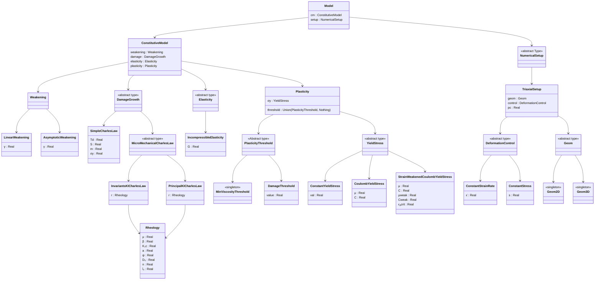

# SCAM 

A [Julia](http://julialang.org) 0-dimensional implementation of the Sub-Criticaly Altered Maxwell model.

#### Author
- Léo Petit, École Normale Supérieure de Paris, France.

#### License

`SCAM` is licensed under the [MIT license](./LICENSE.md).

#### Installation

`SCAM` is not a registered package and can be installed from the package REPL with
```julia
pkg> add https://github.com/Leooop/SCAM.jl.git
```
or similarly with
```julia
julia> using Pkg ; Pkg.add("https://github.com/Leooop/SCAM.jl.git")
```
Requires Julia v1.7 or higher

#### Introduction

This rheological model considers the growth of tensile cracks in a compressive state of stress,based on the wing-crack model of Ashby & Sammis (1991) coupled with a sub-critical crack growth law (Charles, 1958).
The material is assumed elastically incompressible, in view of a use in long-term tectonic simulations.
It uses an empirical linear dependance of the shear modulus on damage $D = \frac{4}{3}\pi N_v (l+\alpha a)^3$, were $N_v$ is the number of cracks per unit volume, $l$ is the length of each tensile crack growing from the tips of closed penny-shaped cracks of radius $a$ and oriented at an angle $\psi=\cos^{-1}{\alpha}$.
The penny-shaped cracks normals are assumed to be be contained in the $\sigma_1$-$\sigma_3$ plane, such that long term behavior post crack coalescence (at $D \sim  1$) can be represented by 2-dimentional Mohr-Coulomb plasticity in the same plane.

This model in the 0-D approximation is able to accurately describe the deformation of compact rocks under various confining pressures, strains rate and under creep conditions (stress kept constant). The dependence of temperature is, for now, not implemented.

This model can be coupled with the unregistered packages [DataFormatter.jl](https://github.com/Leooop/DataFormatter.jl) and [ParametersEstimator.jl](https://github.com/Leooop/ParametersEstimator.jl) to perform bayesian parameters inversion against triaxial experimental data under constant strain rate or brittle creep conditions.

#### Usage

The top level `Model` type displays the following type hierarchy :



#### Examples

Let's load `SCAM`, an ODE solver and a plotting package

```julia
using SCAM
using OrdinaryDiffEq
using Plots
```

Let's assume that we want to model the mechanical behavior of a rock under axisymmetric loading (i.e. $\sigma_2 = \sigma_3 =$ 50 MPa) and constant axial strain rate of $-10^{-5}~$s$^{-1}$.

We need a `NumericalSetup` type corresponding to the above conditions :

```julia
setup = TriaxialSetup(
    geom = Geom3D(),
    control = ConstantStrainRate(-1e-5)
    pc = 50e6
) 
```

We seek to model the damaged-elastic part of the deformation with Incompressible elasticity and a shear modulus of 30 GPa :

```julia
elast = IncompressibleElasticity(G = 30e9)
```

Assume penny-shaped cracks of radius $a=0.5~$mm and oriented at an angle $\psi = 45°$ (actually the only possible value) are initially present in the material and are characterized by damage $D_0 = 0.2$ (function of their number per unit volume). 

```julia
mmp = MicromechanicalParameters(
        μ=0.7, 
        ψ=45, 
        a=0.5e-3, 
        D₀=0.2, 
        n=10, 
        K₁c=2e6, 
        l̇₀=1e-2
)
```

where $\mu$ is the coefficient of friction of the material. $K_{Ic}$ is the fracture toughness of the material, $n$ is the Charles' exponent and $\dot{l}_0$ the reference tensile crack speed. The Charles (1958) subcritical crack growth law reads :

$$ \dot{l} = \dot{l}_0 \left(\frac{K_I}{K_{Ic}}\right)^n\ .$$ 

The evaluation of the stress intensity factor $K_I$ can be performed using the principal stresses (see Ashby and Sammis, 1991) which we indicate by wrapping the micromechanical parameters in the following type :

```julia
damage_growth = PrincipalKICharlesLaw(mmp)
```


Now we need a connection between damage and the mechanical behavior. This is done through a damage-induced weakening of the shear modulus. In this package you can choose between a linear and an assymptotic weakening. Let's use the form with $\gamma = 0.5$. This parameter corresponds to the residual value of shear modulus when the material is broken (i.e., $D = 0$) :

```julia
weak = LinearWeakening(0.5)
```

We can now assemble the `ConstitutiveModel` type

```julia
cm = ConstitutiveModel(
    weakening = weak,
    damage = damage_growth,
    elasticity = elast,
    plasticity = nothing
)
```

An finally the full model, with the setup informations

```julia
model = Model(cm,setup)
```

The coupled integration of axial stress and damage is then performed using

```julia 
sol = simulate(model, tspan; 
        solver = Tsit5(), # ODE solver
        saveat = [], 
        abstol = 1e-6,
        reltol = 1e-4,
        maxiters = 1e5,
        Dᵢ=nothing, # if nothing D(t0) = D0
        Dmax=0.95,
        stop_at_peak = false,
        cb=nothing # whatever DiffEq Callback. If nothing, uses the appropriate callbacks
) 
```

The sol return variable is the Solution type ouput by `OrdinaryDiffEq` we can straightforwardly plot it


