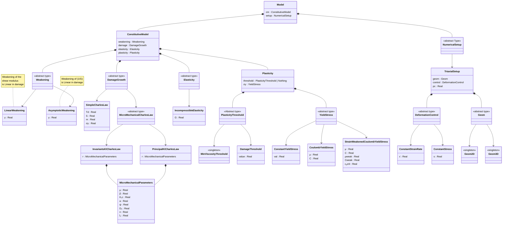
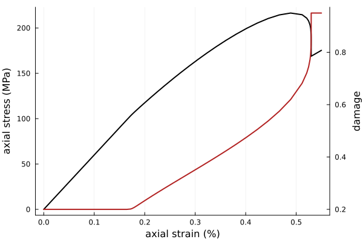
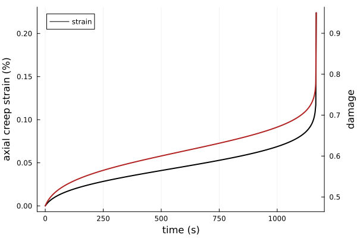

# SCAM 

A [Julia](http://julialang.org) 0-dimensional implementation of the Sub-Criticaly Altered Maxwell model.

#### Author
- Léo Petit, École Normale Supérieure de Paris, France.

#### License

`SCAM` is licensed under the [MIT license](./LICENSE.md).

#### Installation

`SCAM` is not a registered package and can be installed from the package REPL with
```julia
pkg> add https://github.com/Leooop/SCAM.jl.git
```
or similarly with
```julia
julia> using Pkg ; Pkg.add("https://github.com/Leooop/SCAM.jl.git")
```
Requires Julia v1.7 or higher

#### Introduction

This rheological model considers the growth of tensile cracks in a compressive stress state, based on the wing-crack model of Ashby & Sammis (1991) coupled with a sub-critical crack growth law (Charles, 1958).
Although tensile crack growth is associated with material dilatancy, the material is assumed elastically incompressible, in view of a use in long-term tectonic simulations.
It uses an empirical linear dependance of the shear modulus on damage $D = \frac{4}{3}\pi N_v (l+\alpha a)^3$, were $N_v$ is the number of cracks per unit volume, $l$ is the length of each tensile crack growing from the tips of closed penny-shaped cracks of radius $a$ and oriented at an angle $\psi=\cos^{-1}{\alpha}$.
The penny-shaped cracks normals are assumed to be be contained in the $\sigma_1$-$\sigma_3$ plane, such that long term behavior post crack coalescence (at $D \sim  1$) can be represented by 2-dimentional Mohr-Coulomb plasticity in the same plane.

This model in the 0-D approximation is able to accurately describe the deformation of compact rocks under various confining pressures, strains rate and under creep conditions (stress kept constant). The dependence of temperature is, for now, not implemented.

Coupled with the unregistered packages [DataFormatter.jl](https://github.com/Leooop/DataFormatter.jl) and [ParametersEstimator.jl](https://github.com/Leooop/ParametersEstimator.jl), This model can be used to perform bayesian parameters inversion against triaxial experimental data under constant strain rate or brittle creep conditions.

#### Get started

To simulate the mechanical behavior of a damaged material, you first need to build a `Model` Instance. 
The `Model` constructor takes two arguments : 
- A `ConstitutiveModel` instance, representing the rheology of the material
- A `NumericalSetup` instance, including the geometry of the problem and setting control parameters for the simulation.

The class diagram of the next section helps understanding types relationships within this `Model` type. 

Once you created your `model::Model` instance, you just need to call 

```julia 
tspan = (0.0, 530)
sol = simulate(model, tspan; 
        solver = Tsit5(), # ODE solver
        saveat = range(0, tspan[2]; length=500), # array of times saved in sol
        abstol = 1e-6, # absolute tolerance of the solver
        reltol = 1e-4, # relative tolerance of the solver
        maxiters = 1e5, # maximum number of solver iterations
        Dᵢ=nothing, # initial damage (if not specified or nothing: D(t0) = D0)
        Dmax=0.95, # maximum damage value
        stop_at_peak = false, # whether the solver should stop when peak stress is achieved
        cb=nothing # DiffEq Callbacks. If nothing, uses default callbacks appropriate to the NumericalSetup of the Model
) 
```


#### Model architecture

The top level `Model` type displays the following type hierarchy :



#### Examples

The code in this section can also be found in the [example](https://github.com/Leooop/SCAM.jl/tree/master/examples) folder.

##### Constant axial strain rate axisymmetric simulation
Let's load `SCAM`, an ODE solver library and a plotting package

```julia
using SCAM
using OrdinaryDiffEq
using Plots
```

Let's assume that we want to model the mechanical behavior of a rock under axisymmetric loading (i.e. $\sigma_2 = \sigma_3 =$ 50 MPa) and constant axial strain rate of $-10^{-5}~$s${}^{-1}$.

We need a `NumericalSetup` type corresponding to the above conditions :

```julia
ϵ̇ = -1e-5
setup = TriaxialSetup(
    geom = Geom3D(),
    control = ConstantStrainRate(ϵ̇),
    pc = 50e6
) 
```

Note that if we used `Geom2D()` instead of `Geom3D()`, a plane-strain setup would be generated, thus still a 3-D approximation.

We seek to model the damaged-elastic part of the deformation with Incompressible elasticity and a shear modulus of 30 GPa :

```julia
elast = IncompressibleElasticity(G = 30e9)
```

Assume penny-shaped cracks of radius $a=0.5~$mm and oriented at an angle $\psi = 45°$ (actually the only possible value) are initially present in the material and are characterized by damage $D_0 = 0.2$ (function of their number per unit volume). 

```julia
mmp = MicroMechanicalParameters(
        μ=0.7, 
        ψ=45, 
        a=0.5e-3, 
        D₀=0.2, 
        n=10, 
        K₁c=2e6, 
        l̇₀=1e-2
)
```

where $\mu$ is the coefficient of friction of the material. $K_{Ic}$ is the fracture toughness of the material, $n$ is the Charles' exponent and $\dot{l}_0$ the reference tensile crack speed. The Charles (1958) subcritical crack growth law reads :

$$ \dot{l} = \dot{l}_0 \left(\frac{K_I}{K_{Ic}}\right)^n\ .$$ 

The evaluation of the stress intensity factor $K_I$ can be performed using the principal stresses (see Ashby and Sammis, 1991) which we indicate by wrapping the micromechanical parameters in the following type :

```julia
damage_growth = PrincipalKICharlesLaw(mmp)
```


Now we need a connection between damage and the mechanical behavior. This is done through a damage-induced weakening of the shear modulus. In this package you can choose between a linear and an assymptotic weakening. Let's use the form with $\gamma = 0.5$. This parameter corresponds to the residual value of shear modulus when the material is broken (i.e., $D = 0$) :

```julia
weak = LinearWeakening(0.5)
```

We can now assemble the `ConstitutiveModel` type

```julia
cm = ConstitutiveModel(
    weakening = weak,
    damage = damage_growth,
    elasticity = elast,
    plasticity = nothing
)
```

and finally the full model, also using the setup informations :

```julia
model = Model(cm,setup)
```

The coupled integration of axial stress and damage is then performed up to $530~$s by invoquing

```julia 
tspan = (0.0, 530)
sol = simulate(model, tspan; 
        solver = Tsit5(), # ODE solver
        saveat = range(0, tspan[2]; length=500), 
        abstol = 1e-6,
        reltol = 1e-4,
        maxiters = 1e5,
        Dᵢ=nothing, # if nothing D(t0) = D0
        Dmax=0.95,
        stop_at_peak = false,
        cb=nothing # whatever DiffEq Callback. If nothing, uses the appropriate callbacks
) 
```

If you want to use you own ODE solver, the package also provides the lower level function 

```julia
update_derivatives!(du::Vector,u::Vector,p::NamedTuple,t::Any,model::Model)
```

returning the relevant vector of time derivatives `du` from state `u` and model `model`. `p` must be a `NamedTuple` containing the field `Dmax`. Overall for Constant strain rate models the state vector contains the axial deviatoric stress and damage, whereas for constant stress setup, the deviatoric stress is replaced by the creep strain rate. `t` can be input anything, it is not used, and is there to satisfy `OrdinaryDiffEq.jl` interface.

The `sol` return variable is the `Solution` type ouput by `OrdinaryDiffEq`. We can straightforwardly plot it :

```julia
ϵs = -sol.t.*ϵ̇.*100 # in %
σs = sol[1,:]
Ds = sol[2,:]
plot(ϵs, -σs./1e6,
    c=:black,
    lw=2,
    label="",
    xlabel = "axial strain (%)",
    ylabel = "axial deviatoric stress (MPa)"
)
plot!(twinx(), ϵs, Ds,
    c = :firebrick,
    lw=2,
    label = "",
    ylabel= "damage"
)
```




##### Constant stress (brittle creep) axisymmetric simulation

In order to model the brittle creep (also referred to as static fatigue) behavior of the same material under the same confining pressure, we need to get the rock to the desired stress and then keek the axial stress fixed. Let's evaluate brittle creep behavior at $\sigma_c = 200$ MPa. We can reuse previous results to obtain the damage state at this stress level :

```julia 
creep_stress = -200e6
σs_to_peak = σs[1:findfirst(diff(σs).>= 0)]
id = argmin(abs.(σs_to_peak .- creep_stress))

σc = σs[id]
Dᵢc = Ds[id]
```

We then create a new constant stress setup and reinstantiate a model,

```julia 
setup_creep = TriaxialSetup(
    geom = Geom3D(),
    control = ConstantStress(σc),
    pc = 50e6
) 

model_creep = Model(cm,setup_creep)
```

integrate again (notice the initial damage initialized at $D_i c$)

```julia 
tspan = (0.0, 1500)
sol_creep = simulate(model_creep, tspan; 
        solver = Tsit5(), # ODE solver
        saveat = range(0, tspan[2]; length=500), 
        abstol = 1e-6,
        reltol = 1e-4,
        maxiters = 1e5,
        Dᵢ = Dᵢc, # if nothing D(t0) = D0
        Dmax=0.95,
        stop_at_peak = false,
        cb=nothing # whatever DiffEq Callback. If nothing, uses the appropriate callbacks
) 
```

and plot !

```julia
ts_creep = sol_creep.t
ϵs_creep = -sol_creep[1,:].*100 # in %
Ds_creep = sol_creep[2,:]

plot(ts_creep, ϵs_creep,
    c=:black,
    lw=2,
    label="strain",
    legend =:topleft,
    xlabel = "time (s)",
    ylabel = "axial creep strain (%)"
)
plot!(twinx(), ts_creep, Ds_creep,
    c = :firebrick,
    lw=2,
    label = "",
    ylabel= "damage"
)
```

